# Déploiement de site

## Résumé

Vous allez déployer votre projet sur serveur.

Le processus est découpé en plusieurs étapes, au cours desquelles vous allez apprendre à utiliser un `Web Panel`, un logiciel `FTP` ou une connexion `SFTP`, et l'import/export de base de données.

Ce savoir sera utile tout au long de votre vie de développeur. Ça fait partie de ces choses universelles, peu importe qu'on pratique du `Wordpress`, du `Symfony`, ou autre technologie web.

La procédure est toujours la même pour ce type de déploiement. C'est la méthode la plus simple et directe pour "pousser" un site en production, mais ce n'est pas la seule qui existe.

Sachez simplement que le déploiement est un domaine à part entière à ranger dans la famille "DevOps", qui est un métier à lui tout seul.

Dans ce process, nous utiliserons l'adresse ip **152.228.211.148**.

⚠️ **Votre site ne fonctionnera probablement pas tout de suite exactement comme vous le souhaitez. Les déploiements comportent toujours leur lot de surprises, donc soyez prêt à faire du debug.**

Nous allons vous donner un accès à la gestion du serveur avec runcloud
Veuillez commencer par vous connecter au serveur runcloud ici : 
[https://manage.runcloud.io/auth/register](https://manage.runcloud.io/auth/register)

Une fois cela fait vous allez pouvoir commencer à suivre les étapes de déploiement

## Première étape Création de l’utilisateur:

Maintenant que vous avez accès au Web Panel runcloud la première étape consiste à créer un utilisateur sur le serveur
Pour cela dirigez vous sur **Servers** cliquez sur **projets garage404** puis aller sur **System User** 

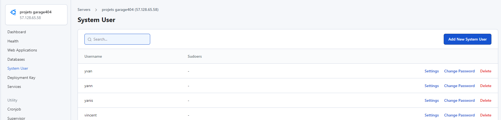

Cliquez sur le bouton bleu **Add New System User** puis créer un utilisateur

⚠️ **Vous avez besoin que d’un utilisateur pour tous vos projets pas besoin d’en créer un à chaque fois**

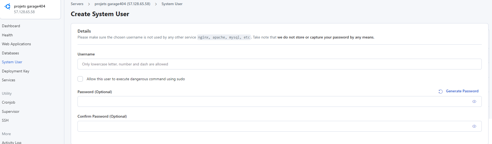

Entrer votre prénom puis un mot de passe 

(Pensez à noter vos identifiants quelque part)

⚠️ **Vous n’avez pas besoin de cocher la checkbox**

## Deuxième étape Création de BDD (facultatif):

Préparons notre base de données

Pour cela dirigez vous dans `Databases`

**Si vous n’avez jamais créé d’utilisateur de base de donnée** rendez vous sur **Database Users** puis cliquez sur le bouton **Add New Database User**.
Rentrez votre prénom et un mot de passe (vous pouvez utiliser le même que celui de votre utilisateur pour ne pas l'oublier)

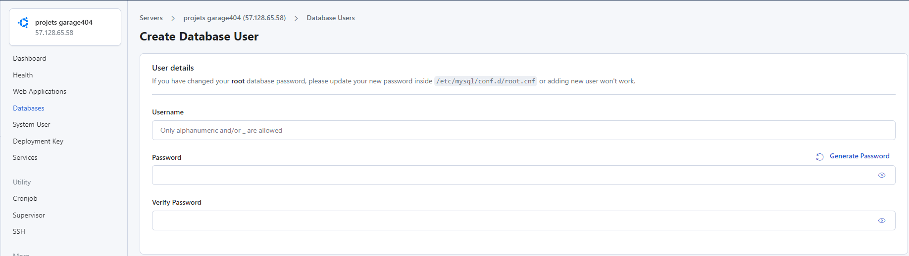

Rendez vous ensuite sur l’onglet Databases et cliquez sur Add New Database

Entrer le nom de la base de données. Je vous conseil de suivre cette petite convention de nommage pour éviter de futur conflit et pour qu’on puisses se repérer facilement :
prénom + nom de la base de donnée **(par exemple : hamza_mini_chat)**

Collation :  **utf8_general_ci** ou **utf8md4_general_ci**

Assign Database User : **choisissez votre utilisateur** 

Une fois la base de données créé, nous allons pouvoir accéder à PhpMyAdmin

Dirigez vous sur PhpMyAdmin et cliquez sur le lien de la colonne **Domain**

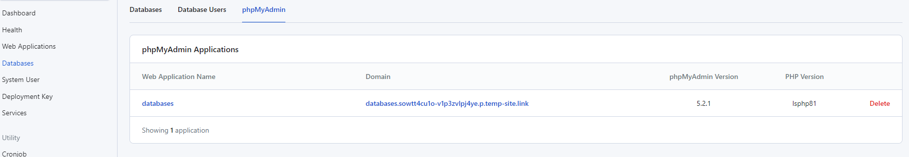

Connectez-vous avec votre utilisateur de base de données.
Une fois connecté vous devriez retrouver votre base de donnée créée précédemment

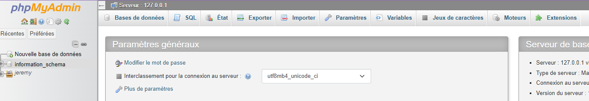

**Si vous ne la voyez pas, retournez sur l’onglet Databases, vous allez devoir retirer votre utilisateur de la base de données et re-assigner votre utilisateur à celle-ci (cela devrait faire réapparaitre la base de données sur phpmyadmin).**

A partir de là, vous allez devoir exporter votre base de données local à celle du serveur : 

Rendez vous sur votre phpmyadmin en local et allez dans l’onglet exporter :

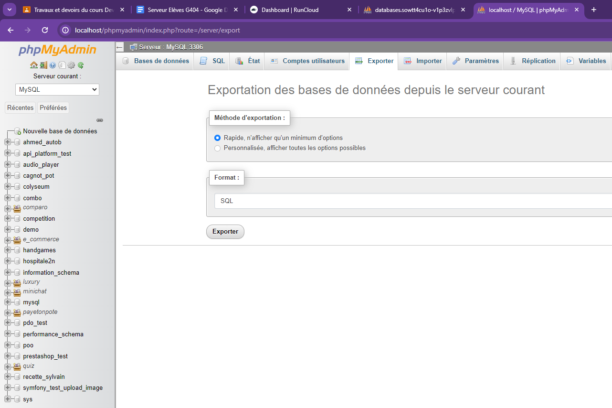

Puis exporter le fichier .sql
Retournez sur le phpmyadmin du serveur, **allez dans votre base de données vide puis dans l’onglet Importer**.
Cliquez sur le bouton **Choisir un fichier** et choisissez le fichier sql que vous venez de télécharger

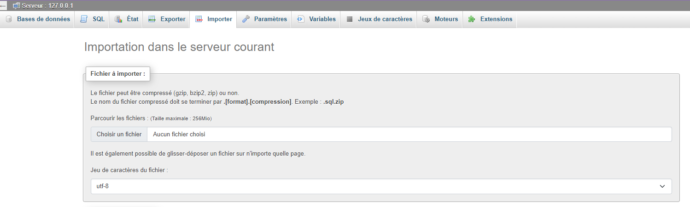

Cliquez ensuite sur le bouton **Importer** en bas.

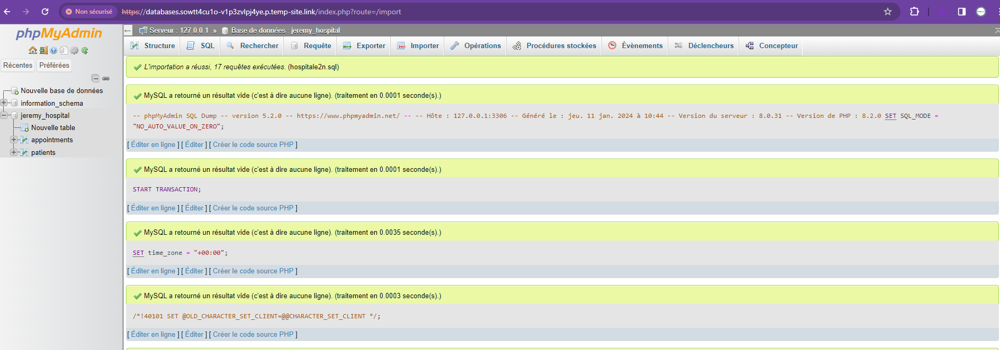

Votre base de données est maintenant prête.

## Troisième étape Création de la webapp :

Retourner sur le **Dashboard** du serveur sur Runcloud : 
Et cliquez ensuite sur le bouton **Deploy New Web App**

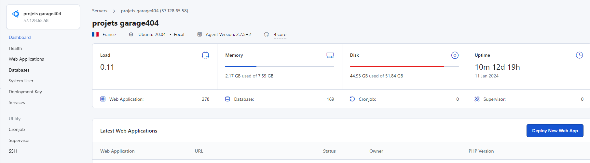

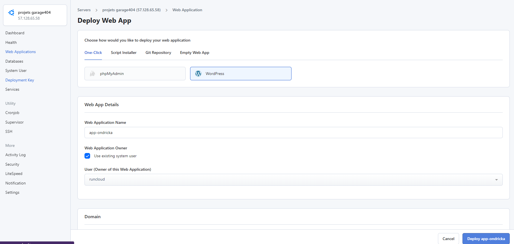

Ici plusieurs étapes sont possible mais 2 ou 3 d’entre elle vous seront utile : 

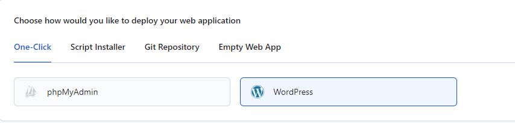

**One-Click** propose de créer un Wordpress ou una app phpmyadmin directement
**Pour le moment cela ne nous est pas utile** (nous verront wordpress un peu plus tard dans la formation.)

L’onglet **Script Installer** permet de lancer l’installation de différents projets (PrestaShop, Drupal, Joomla, ou autre) nous n’en avons pas forcément besoin non plus.

**Git Repository** propose de se connecter directement à votre repository git, laissons cette méthode de côté pour le moment nous le ferons manuellement pour le moment. 

Il nous reste donc **Empty Web App** qui générera un fichier index.html par défaut qu’il faudra ensuite remplacer par nos fichiers.

### **Choississez Empty Web App**

Commençons la configuration de la webapp : 

**Web App Details :** 

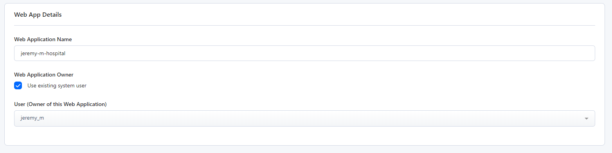

Entrez votre **prénom-{nom-de-l’app}**
Cochez la checkbox et choisissez votre utilisateur dans la liste déroulante

**Nom de domaine : {prenom-nom-de-l’app}.codegt.garage404.com ** 

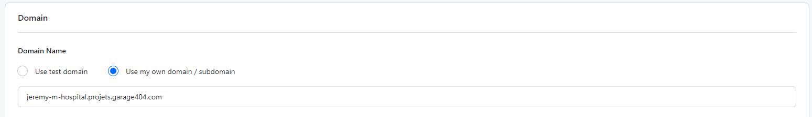

Paramétrer ensuite le nom de domaine 
Pour cela cocher le bouton radio Use my own domain/ subdomain
Puis entrez l’url de votre projet comme ceci : 
**{prenom-nom-de-l’app}.codegt.garage404.com**
De préférence évitez les caractères spéciaux utilisez simplement des tiret a la place des espaces.

**Certificat SSL :**

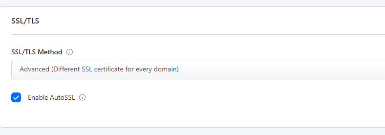

Pour cette section cochez simplement la checkbox **Enable AutoSSL**
Cela générera un certificat SSL pour obtenir une url sécurisé HTTPS

**Basic Settings** 

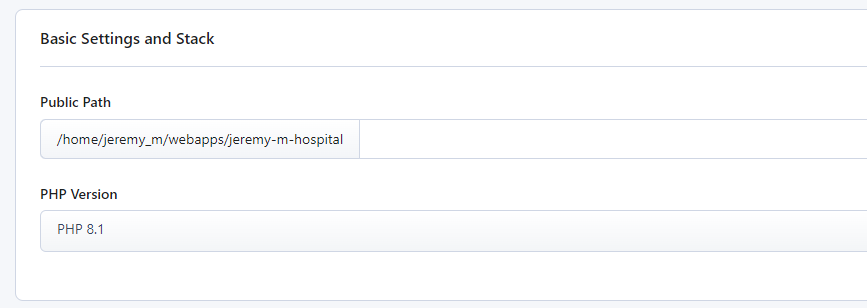

Sélectionnez juste votre version de php si vous ne savez pas laquelle choisir prenez PHP 8.1

Une fois fait, vous pouvez cliquer sur le bouton Deploy Situé en bas à droite.

Votre Web App est maintenant créé, vous vous trouvez dès à présent sur le dashboard de votre application.

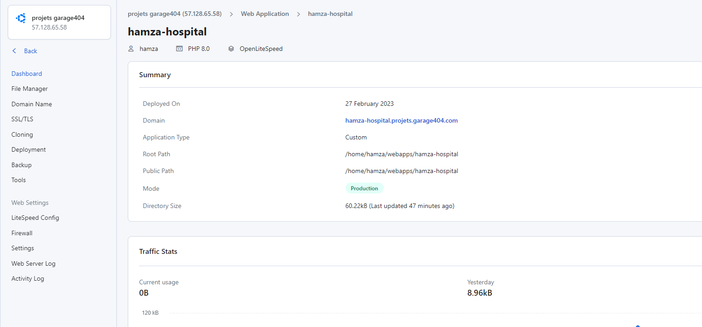

Maintenant que la webapp est créée il va falloir ajouter la base de données que vous avez créé précédemment.

Pour cela rendez vous dans Settings scroller jusqu’à **Linked Database** et sélectionnez votre base de données.

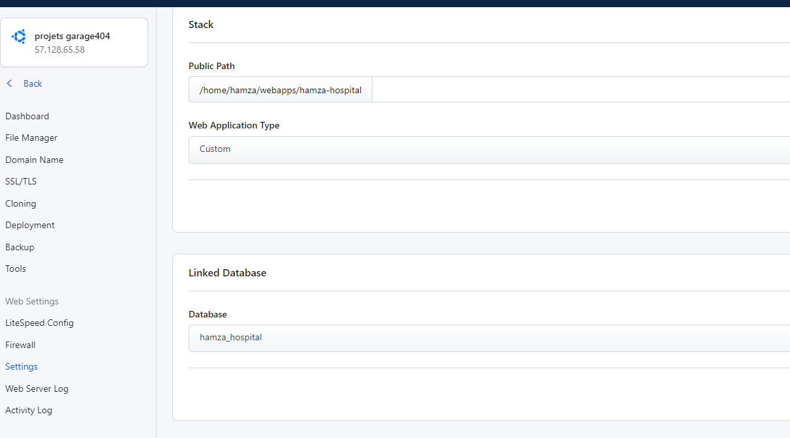

Cliquez ensuite sur **Update Linked Database**.

## Quatrième étape connexion et déploiement de notre projet sur le serveur :

Vous allez maintenant déployer les fichiers de votre projet sur la webapps 

Vous avez le choix entre 2 méthodes SFTP ou SSH : 
### De manière général, préférez l’utilisation du SSH pour vos propres serveurs.
### Nous utiliserons ici SFTP même si cette méthode entraîne une plus grosse charge sur le serveur. 
### Runcloud peut ban automatiquement une adresse ip qui est responsable d'une charge serveur trop lourde.
### Il ban également l’adresse ip suite à 3 échecs de connexion 

#### SFTP : 

Pour se connectez au serveur en SFTP vous avec besoin d’un client FTP 
Je vous conseil donc d’utiliser et télécharger [Filezilla](https://filezilla-project.org/) ou [WinSCP](https://winscp.net/eng/download.php) (uniquement sur windows)

Une fois téléchargé vous allez devoir vous connecter au serveur à l'aide de l’adresse IP + votre nom d’utilisateur et mot de passe créé à la première étape de cette documentation.

L’adresse ip du serveur est visible à ce niveau la :

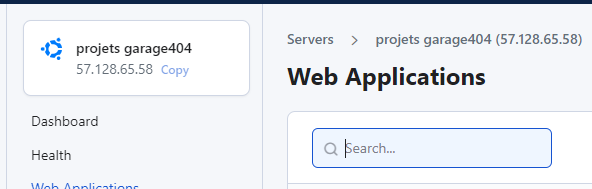

Pour se connecter : 
Nom d’hote : 152.228.211.148
Port : 22
Nom d’utilisateur : celui que vous avez créé à la première étape 
Mot de passe : celui que vous avez créé à la première étape 

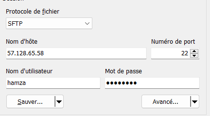

Une fois connecté rendez-vous dans le dossier webapps et entrez dans le dossier de votre projet. Vous y retrouverez le fichier index.html créé par défaut qu’il faudra supprimer et remplacer par les fichiers de votre projet.

Sur la partie gauche aller chercher vos fichier faire un drag and drop de vos fichier à gauche vers le serveur à droite : 

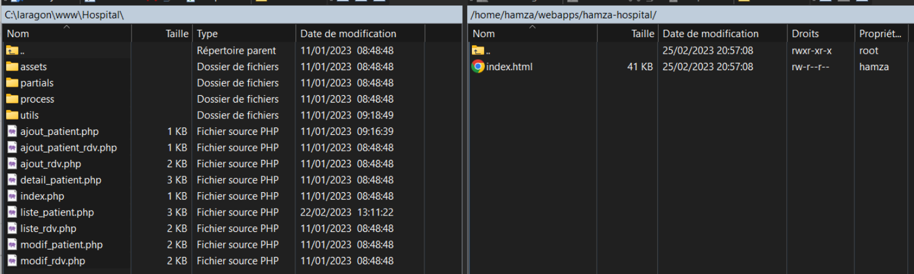

Une fois cela fait il va falloir modifier et corriger quelques fichiers notamment la connexion à votre base de donné : 
Le host est toujours localhost ou 127.0.0.1 (ce sera le localhost du serveur) 
Il vous faudra modifier le nom, le mot de passe, et le nom d’utilisateur de la base de données en mettant ceux que vous avez créé à la partie 2.

Vous pouvez dès à présent vérifier votre site à l'aide de la nouvelle url. 
Vérifier que toutes les pages soient accessibles sinon corrigez les chemins et les liens si besoin.

#### SSH : 

La deuxième méthode de déploiement nécessite un peu plus de configuration.
Premièrement il va nous falloir un client SSH 

Je vous conseille de télécharger et d’utiliser [PuTTY](https://www.putty.org/) sur windows.

Sur linux tout peut se faire à l'aide du terminal (à l’aide la commande ssh)

**Pour Windows : (Putty)**

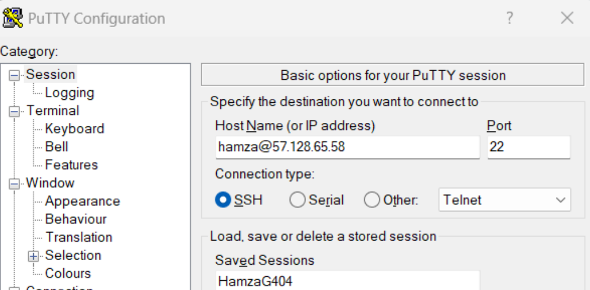

Une fois putty ouvert entrez votre nom d’utilisateur@l’adresse ip du serveur utilisez le port 22 

Pour exemple hamza@152.228.211.148

Une fois rempli cliquez sur open un terminal s’ouvre alors sur une nouvelle fenêtre en vous demandant votre mot de passe. Entrez le mot de passe créer à l’étape 1.

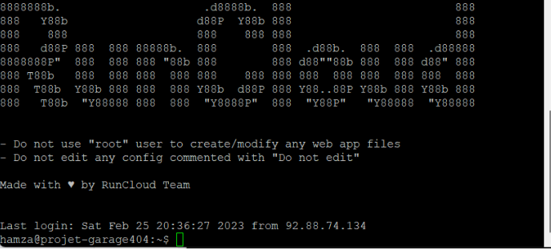

**Pour linux : (Commande SSH)**

A l’aide du terminale de commande entrez la commande : 

Exemple :

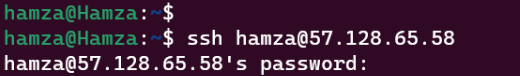

Entrez le mot de passe créer à l’étape 1.

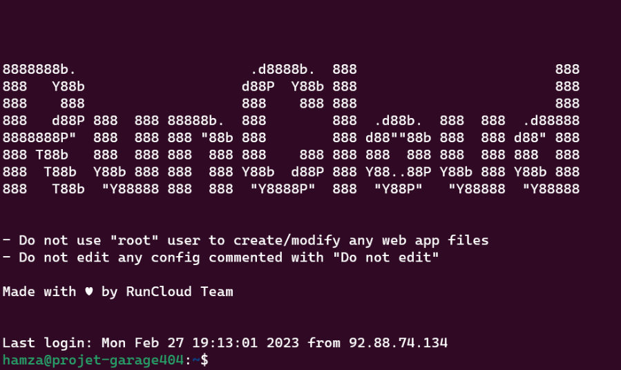

Une fois connecté vous vous trouvez à la racine de votre utilisateur 
naviguer à l'aide des commandes `cd` et `ls` pour vous diriger dans webapps et le dossier de votre projet.

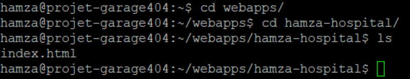

On retrouve le fichier index.html comme pour la connexion ftp 
Supprimer le en utilisant la commande `rm ./index.html`
Vous pouvez ensuite cloné votre projet github directement sur le serveur : 
`git clone https://github.com/HamzaKarfa/Hospital.git ./`

### **🚨 Ne pas oublier “ ./” à la fin de votre commande sinon le clone sera dans un sous-dossier ! 🚨**

**⚠️ Attention : Si vous utilisez un framework (symfony laravel) assurez-vous de ne jamais envoyer votre .env sur vos repository git car il contient les informations de connexion sécurisé qui ne doivent pas être partagées. il faudra le re-créer manuellement sur le serveur (voir : .env, .env.prod, .env.local, .env.test). ⚠️**

➡️ veuillez vous diriger vers [cette partie](https://github.com/G404-DWWM/Toolbox-D-ploiement-Projet?tab=readme-ov-file#d%C3%A9ploiement-de-projet-symfony), pour en savoir plus sur la mise en production de vos projets symfony

A l’aide de la commande nano il vous faudra modifier le fichier de connexion à la base de données.
Modifier le nom, le mot de passe, et le nom d’utilisateur en mettant ceux que vous avez créé à la partie 2.
Vous pouvez dès à présent vérifier votre site à l'aide de la nouvelle url. 
Vérifier que toutes les pages soient accessibles sinon corrigez les chemins et les liens si besoin.

## Déploiement de projet Symfony

Pour le déploiement de projet Symfony, nous reprendrons une fois que vous êtes arrivé à l'étape du [clone de votre projet](https://github.com/G404-DWWM/Toolbox-D-ploiement-Projet?tab=readme-ov-file#ssh-).

**⚠️ A partir de cette étape les étapes ne sont pas les mêmes qu’avec vos autres projets. ⚠️**

Je vous invite à consulter la [doc Symfony](https://symfony.com/doc/current/deployment.html) en complément de ce document pour en
apprendre plus sur comment déployer vos applications Symfony.

### Première étape - recréer le .env

Avec l’aide du File Manager du serveur, ou en utilisant la commande nano, il vous faudra copier les informations du .env (ou .env.local ou autres), de votre projet local pour les coller sur le .env que vous avez récupéré sur le serveur.

Changez la ligne APP_ENV=dev par APP_ENV=prod. Nous ne sommes plus en développement mais nous faisons ici une **mise en production**.

### Deuxième étape - Installer/Update votre Vendor

Utilisez la commande : `composer install --no-dev --optimize-autoloader`

#### 🚨 **Attention : Il ne faut pas simplement faire “composer install”, car notre application en prod n’a pas besoin des mêmes dépendances qu’en dev. En effet, les outils de debugging par exemple ne nous servent à rien en environnement de prod** 🚨

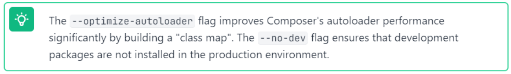

Ensuite utilisez la commande : `composer dump-env prod` qui vous générera un `.env.local.php` optimisé qui prévaudra sur vos autres fichiers `.env` !

Ensuite utilisez la commande `composer require symfony/apache-pack` et vérifiez que dans votre dossier public, **le fichier .htaccess soit bien généré**.

Si ce n’est pas le cas, lancez la commande `composer remove symfony/apache-pack` puis refaites le composer require.

Une fois le fichier .htaccess présent : dans le menu à gauche, sélectionner **LiteSpeed** puis cliquer sur le bouton Update Config

### Troisième étape - Nettoyer votre cache

Ici il s’agit de nettoyer votre cache de prod et non pas votre cache de dev. Pour ce faire lancez la commande suivante : `APP_ENV=prod APP_DEBUG=0 php bin/console cache:clear`

Beaucoup de problèmes qui surviennent lors de la mise en production d’un site sont dû au cache, n’hésitez pas à lancer cette commande dès que quelques chose vous semble bizarre !

### Quatrième étape - Définir le chemin du dossier public

Sur symfony, le dossier qui est affiché sur votre client et qui contient l’index, est le dossier “public”, c’est donc lui qui doit être lu en premier lorsque l’on demande d’accéder à la racine de votre site. Pour ce faire rien de plus simple :

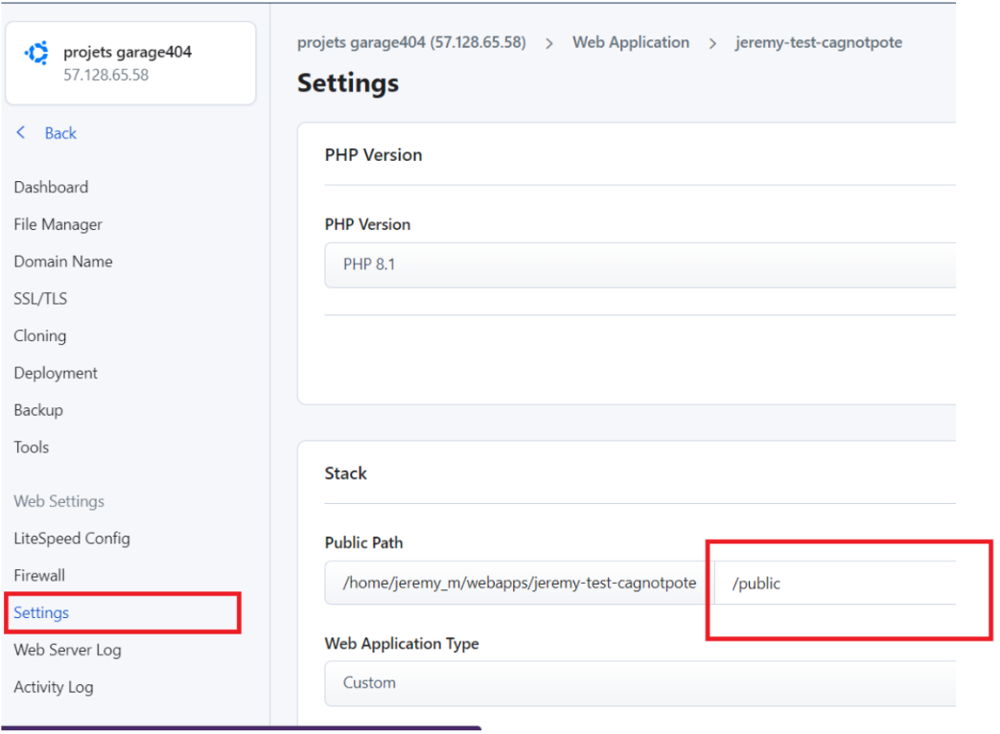

Lorsque vous êtes sur un projet, rendez-vous dans **`Settings`** et renseignez le dossier public en tant que **`Public Path`**

**Vous pouvez maintenant consulter votre projet Symfony sur internet !**

## Sécurité : 

Pour la sécurité de chacun certains accès vous seront interdits sur ce serveur.

Si vous souhaitez effectuer une action qui ne vous est pas permise ou si vous avez fait une erreur, veuillez vous adresser au formateur référent (par mail : hamza@kaffein.agency, Sur discord Hamza ou H_mz_#7229).

## En apprendre plus sur la gestion des déploiements

[https://www.armandphilippot.com/article/dotenv-variables-environnement](https://www.armandphilippot.com/article/dotenv-variables-environnement)

[https://www.lemagit.fr/definition/Deploiement-continu](https://www.lemagit.fr/definition/Deploiement-continu)

[https://symfony.com/doc/current/configuration.html#configuration-based-on-environment-variables](https://symfony.com/doc/current/configuration.html#configuration-based-on-environment-variables)
